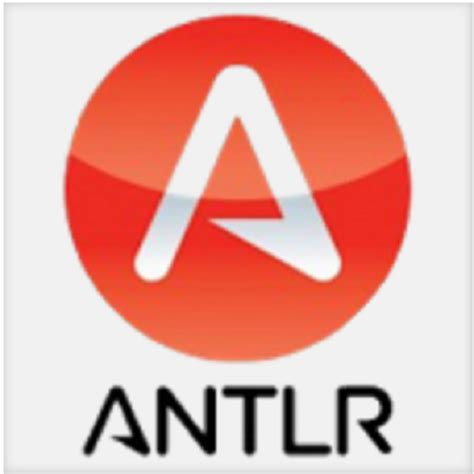

# About me...
Hello! I'm David(Tengjun) Gao

- I'm currently studying at [Northeastern University](https://www.northeastern.edu/about/) in Master of Informatics
- I earned my bachelor degree at the [University of Nebraska - Lincoln](https://www.unl.edu/about/) 
- I'm a student majored in Computer Science with Math & Physics minors
- Never stop learning! Connect with me using the link below
- VIM ENJOYER

<!--  -->

<!-- ============================================================== -->

Feel free to chat with me!

...And social networking!

Happy Coding!
<!-- ============================================================== -->
### Updates

My recent blog updates

<!-- BLOG-POST-LIST:START -->
<!-- https://github.com/:davidgao7/:davidgao7.github.io/commits.atom ITS NOT WORKIN-->

- [数组](https://github.com/davidgao7/davidgao7.github.io/blob/5fbd13fe6d44905a84a50dafb08723ae81a3a667/_posts/2021-11-23-array-summary.md)
- [复杂链表的复制](https://github.com/davidgao7/davidgao7.github.io/blob/master/_posts/2021-10-07-copy-random-list.md)
- [所有叶子节点到根节点的和](https://github.com/davidgao7/davidgao7.github.io/blob/master/_posts/2021-10-05-binary-tree-path-sum.md)
- [python generator 你需要知道的点](https://github.com/davidgao7/PythonLearning/blob/master/generator.py)
- [寻找第K大](https://github.com/davidgao7/davidgao7.github.io/blob/master/_posts/2021-09-24-find-kth-largest.md)
- [统计字典序元音字符串的数目](https://github.com/davidgao7/davidgao7.github.io/blob/master/_posts/2021-09-21-count-vowel-strings.md)
- [连接两岛的最短路径](https://github.com/davidgao7/davidgao7.github.io/blob/master/_posts/2021-09-15-shortest-bridge.md)
- [打家劫舍II](https://github.com/davidgao7/davidgao7.github.io/blob/master/_posts/2021-09-12-rob.md)
- [跳跃游戏](https://github.com/davidgao7/davidgao7.github.io/blob/master/_posts/2021-09-12-jump-game.md)
- [单词的压缩编码](https://github.com/davidgao7/davidgao7.github.io/blob/master/_posts/2021-09-08-minimum-length-encoding.md)
- [二叉树两个节点找公共祖先](https://github.com/davidgao7/davidgao7.github.io/blob/master/_posts/2021-08-21-tree-lowest-common-ancestor.md)
- [最长无重复子数组](https://github.com/davidgao7/davidgao7.github.io/blob/master/_posts/2021-08-20-maxLength.md)
- [Heap and BST](https://github.com/davidgao7/davidgao7.github.io/blob/master/_posts/2021-08-25-heap-bst.md)
- [合并k个有序链表](https://github.com/davidgao7/davidgao7.github.io/blob/master/_posts/2021-08-20-merge-k-sorted-lists.md)
- [二叉树层序遍历](https://github.com/davidgao7/davidgao7.github.io/blob/master/_posts/2021-08-15-binaryTree-Output-Levely.md)
- [随笔](https://github.com/davidgao7/davidgao7.github.io/blob/master/_posts/2021-08-15-suibi.md)
- [SVM拉格朗Prim/dual form](https://github.com/davidgao7/machineLearningAlgorithmExplain/blob/master/SVM%20Lagrange.pdf)
- [SVM Explain](https://github.com/davidgao7/machineLearningAlgorithmExplain/blob/master/SVM.ipynb)
<!-- BLOG-POST-LIST:END -->

### My contribution graph
<picture>
  <source media="(prefers-color-scheme: dark)" srcset="./github-contribution-grid-snake-dark.svg">
  
</picture>

### Most Used Languages

### My Github Stats

### Languages I spend time on mostly

### Other Interesting Languages/Tools I've learned which have not shown

### My Activity Graph

#### Reading the Notebook in webpage
- If you encounter the Jupyter Notebook Rendering Issue
  * If github in unable to render a Jupyter notebook, copy the link of the notebook and enter into the nbviewer: https://nbviewer.jupyter.org/
- If some of the colored text not showing, please use [nbviewer](https://nbviewer.jupyter.org/)

